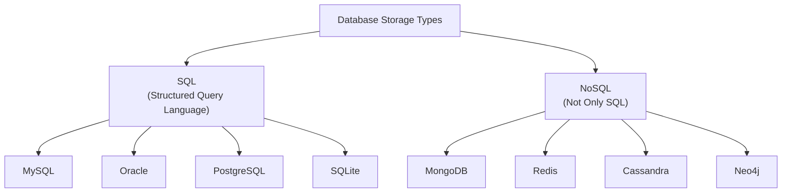
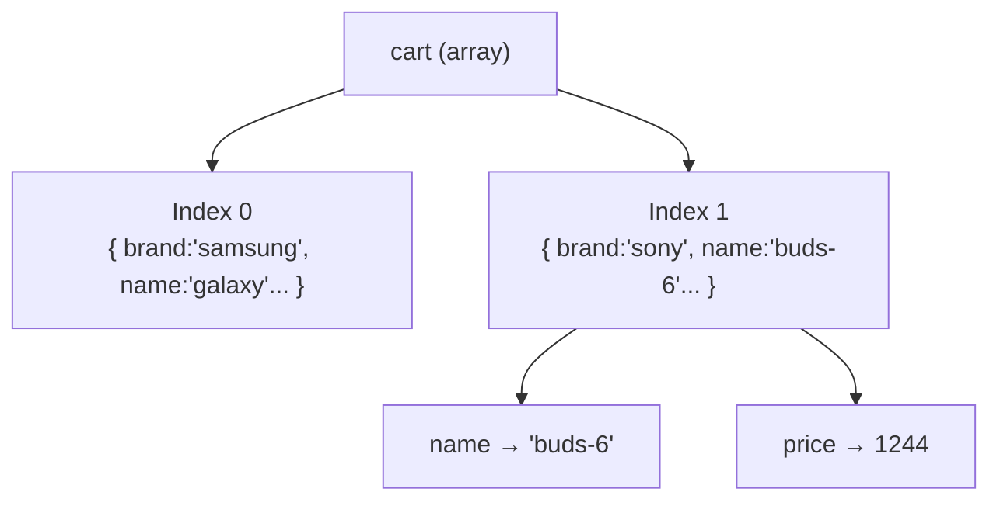

# Data, Databases, JSON, Arrays & Objects

---

## Table of Contents

1. [Data vs Information](#1-data-vs-information)
2. [Database & DBMS](#2-database--dbms)
3. [SQL vs NoSQL](#3-sql-vs-nosql)
4. [Types of NoSQL Databases](#4-types-of-nosql-databases)
5. [JSON — JavaScript Object Notation](#5-json--javascript-object-notation)
6. [BSON — Binary JSON](#6-bson--binary-json)
7. [JavaScript Arrays](#7-javascript-arrays)
8. [JavaScript Objects](#8-javascript-objects)
9. [All Datatypes Inside a JS Object](#9-all-datatypes-inside-a-js-object)
10. [Summary Tables](#10-summary-tables)
11. [Revision Checklist](#11-revision-checklist)

---

## 1. Data vs Information

### Data

**Definition:** Data are **raw, unprocessed facts and figures** — they have no context or meaning on their own.

```
Examples of raw data:
ashwin, 34, 21, 23, varun, html, css, ashwin
```

These numbers and names alone tell us nothing. We don't know what they mean without context.

---

### Information

**Definition:** Information is **processed data** — raw data that has been given context, structure, and meaning.

```
Example of information derived from data:
"Ashwin has scored 34 in the HTML exam."
```

Now the data makes sense — we know who (ashwin), what (score), and for what (HTML exam).

---

### What is stored in a Database?

> **Answer:** Both data and information are stored, but fundamentally a database stores **data** in a structured/semi-structured way so that it can be processed into **information** when queried.

| Term            | Definition                 | Example                      |
| --------------- | -------------------------- | ---------------------------- |
| **Data**        | Raw facts with no context  | `34`, `ashwin`, `html`       |
| **Information** | Processed, contextual data | `"Ashwin scored 34 in HTML"` |

---

## 2. Database & DBMS

### Database

**Definition:** A database is a **collection of organized data** (or information). It is a container used to **store, fetch, and manage** data efficiently.

Think of it like a highly organized digital filing cabinet — you can put things in, find them quickly, update them, and remove them.

---

### DBMS — Database Management System

**Definition:** A DBMS is **software used to perform operations on a database**. It acts as an intermediary between the user/application and the raw data stored on disk.

**Examples of DBMS:** MySQL, Oracle, PostgreSQL, MongoDB, SQLite

### Core Operations — CRUD

Every DBMS supports these four fundamental operations:

| Operation  | SQL Command | Meaning              |
| ---------- | ----------- | -------------------- |
| **C**reate | `INSERT`    | Add new data         |
| **R**ead   | `SELECT`    | Retrieve/fetch data  |
| **U**pdate | `UPDATE`    | Modify existing data |
| **D**elete | `DELETE`    | Remove data          |

```sql
-- SQL CRUD Examples
INSERT INTO users (name, age) VALUES ('Ashwin', 22);    -- Create
SELECT * FROM users WHERE name = 'Ashwin';              -- Read
UPDATE users SET age = 23 WHERE name = 'Ashwin';        -- Update
DELETE FROM users WHERE name = 'Ashwin';                -- Delete
```

---

## 3. SQL vs NoSQL

Data can be stored in two broad ways inside a database:



---

### SQL (Structured Query Language)

| Feature              | Detail                                     |
| -------------------- | ------------------------------------------ |
| **Schema required?** | ✅ Yes — must define table structure first |
| **Data format**      | Tabular (rows and columns)                 |
| **Schema type**      | Fixed / Static                             |
| **Query language**   | SQL                                        |
| **Examples**         | MySQL, Oracle, PostgreSQL, SQLite          |

**Key Rules:**

1. You must **create a table (schema/structure) first** before inserting any data.
2. Data is stored in a **tabular structure** — rows (records) and columns (fields).
3. The schema is **fixed/static** — all rows must conform to the same column structure.

```sql
-- SQL: Must define table structure FIRST
CREATE TABLE employees (
    id     INT PRIMARY KEY,
    name   VARCHAR(100),
    email  VARCHAR(100),
    age    INT
);

-- THEN insert data (must match schema)
INSERT INTO employees VALUES (1, 'Ashwin', 'ash@gmail.com', 22);
INSERT INTO employees VALUES (2, 'Varun', 'varun@gmail.com', 25);
```

---

### NoSQL (Not Only SQL)

| Feature              | Detail                                   |
| -------------------- | ---------------------------------------- |
| **Schema required?** | ❌ No — schema is optional               |
| **Data format**      | Documents, Key-Value, Graph, Wide Column |
| **Schema type**      | Dynamic / Flexible                       |
| **Query language**   | Varies by DB (MongoDB uses MQL)          |
| **Examples**         | MongoDB, Redis, Cassandra, Neo4j         |

**Key Rules:**

1. **No need to define a schema** before storing data.
2. Data can be stored in different formats: documents, key-value pairs, graphs, or wide columns.
3. The structure is **dynamic** — different records can have different fields.

```javascript
// NoSQL (MongoDB): No schema needed — documents can have different fields
// Entry 1
{ name: "abc", id: 123, email: "abc@gmail.com" }

// Entry 2 — missing email field, that's FINE in NoSQL
{ name: "def", id: 345 }

// Entry 3 — has extra fields (age, sal), also FINE
{ name: "yz", email: "y@gmail.com", id: 34, age: 34, sal: 124 }
```

---

### SQL vs NoSQL — Side-by-Side Comparison

| Feature             | SQL                         | NoSQL                                    |
| ------------------- | --------------------------- | ---------------------------------------- |
| **Schema**          | Fixed, must define upfront  | Flexible, dynamic                        |
| **Structure**       | Tables (rows & columns)     | Documents, Key-Value, Graph, Wide Column |
| **Best for**        | Structured, relational data | Unstructured or rapidly changing data    |
| **Scaling**         | Vertical (bigger machine)   | Horizontal (more machines)               |
| **ACID compliance** | ✅ Strong                   | Varies (MongoDB supports it partially)   |
| **Examples**        | MySQL, PostgreSQL, Oracle   | MongoDB, Redis, Cassandra, Neo4j         |

---

## 4. Types of NoSQL Databases

### 4.1 Document-Based NoSQL DB

**Definition:** Data is stored in **document format** — a JSON-like structure (actually BSON in MongoDB). Each document is a self-contained record.

**Examples:** MongoDB, CouchDB

```javascript
// Each entry is a document (flexible fields per document)
let e1 = { name: "abc", id: 123, email: "abc@gmail.com" };
let e2 = { name: "def", id: 345 }; // no email — ok!
let e3 = { name: "yz", email: "y@gmail.com", id: 34, age: 34, sal: 124 };
```

**Real-world use:** User profiles, product catalogs, blog posts — where different records may have different attributes.

---

### 4.2 Key-Value Based NoSQL DB

**Definition:** Data is stored as simple **key → value** pairs. Extremely fast for lookups.

**Primary use case: Caching** — storing frequently accessed data in memory to reduce database/API load and improve performance.

**Examples:** Redis, DynamoDB

```javascript
// Key-Value structure
"user:123:name"    → "Ashwin"
"user:123:session" → "token_abc_xyz"
"product:99:price" → "999"
```

**Real-world use:** Session management, caching API responses, rate limiting, leaderboards.

---

### 4.3 Graph-Based NoSQL DB

**Definition:** Data is stored in **nodes** (entities) and the relationships between them are represented as **edges** (connections between nodes).

**Examples:** Neo4j

```
Node: User(Alice) ---[FOLLOWS]---> Node: User(Bob)
Node: User(Bob)   ---[LIKES]-----> Node: Post(#123)
Node: User(Alice) ---[KNOWS]-----> Node: User(Charlie)
```

**Real-world use:** Social networks (Facebook friends), recommendation engines (Netflix/Amazon), fraud detection, knowledge graphs.

---

### 4.4 Wide-Column / Columnar NoSQL DB

**Definition:** Data is stored in a **table format**, but unlike SQL, the **columns are dynamic** — different rows can have completely different columns.

**Examples:** Cassandra, HBase

```
// Wide column — each row can have different columns
userEntry1:
    col1: name  → "abc"
    col2: id    → 123
    col3: age   → 23

userEntry2:
    col1: name  → "def"
    col2: id    → 456
    col3: age   → 30
    col4: email → "def@gmail.com"   // extra column, only for this row
```

**Real-world use:** AI/ML model training data, time-series data, IoT sensor data, analytics at massive scale.

---

### NoSQL Types Summary

| Type            | Data Format         | Example DBs      | Best For                         |
| --------------- | ------------------- | ---------------- | -------------------------------- |
| **Document**    | JSON/BSON documents | MongoDB, CouchDB | User profiles, catalogs          |
| **Key-Value**   | `key → value` pairs | Redis, DynamoDB  | Caching, sessions                |
| **Graph**       | Nodes + Edges       | Neo4j            | Social networks, recommendations |
| **Wide Column** | Dynamic tables      | Cassandra, HBase | Big data, AI training            |

---

## 5. JSON — JavaScript Object Notation

### What is JSON?

**Definition:** JSON is a **lightweight, language-independent data format** used to exchange data between client and server, or between two servers.

- **Language independent** — any programming language can read/write JSON (Python, Java, Go, JS, etc.)
- **Lightweight** — stores only alphanumeric characters (text-based)
- **Human readable** — easy to read and understand

```
Client  ──[ JSON ]──►  Server
Server  ──[ JSON ]──►  Server
```

---

### JSON Rules (Critical for Interviews)

| Rule                                            | Correct          | Incorrect               |
| ----------------------------------------------- | ---------------- | ----------------------- |
| Keys must be in **double quotes**               | `"name": "abc"`  | `name: "abc"`           |
| No trailing comma after **last** key-value pair | `{"a":1, "b":2}` | `{"a":1, "b":2,}`       |
| **No `undefined`** allowed                      | —                | `"bonus": undefined` ❌ |
| **No functions** allowed                        | —                | `"fn": function(){}` ❌ |
| **No `Date` objects** allowed                   | —                | `"date": new Date()` ❌ |
| String values in **double quotes**              | `"name": "abc"`  | `"name": 'abc'` ❌      |

### Allowed JSON Datatypes

```json
{
  "name": "varun",
  "age": 34,
  "salary": 123.345,
  "isMarried": true,
  "skills": [],
  "address": {},
  "comm": null
}
```

✅ Allowed: `string`, `number`, `boolean`, `array`, `object`, `null`
❌ Not allowed: `undefined`, `function`, `Date`

---

### JSON in Practice

```javascript
// JavaScript Object → JSON string (for sending over network)
const user = { name: "Varun", age: 34, isMarried: true };
const jsonString = JSON.stringify(user);
console.log(jsonString);
// '{"name":"Varun","age":34,"isMarried":true}'

// JSON string → JavaScript Object (when receiving from network)
const received = '{"name":"Varun","age":34}';
const parsed = JSON.parse(received);
console.log(parsed.name); // "Varun"
```

---

## 6. BSON — Binary JSON

**Definition:** BSON stands for **Binary JSON**. It is the format MongoDB uses internally to store documents.

| Feature         | JSON                   | BSON                                                    |
| --------------- | ---------------------- | ------------------------------------------------------- |
| **Format**      | Text (human readable)  | Binary (not human readable)                             |
| **Size**        | Larger (text overhead) | Smaller (binary compressed)                             |
| **Speed**       | Slower to parse        | Faster to encode/decode                                 |
| **Extra types** | Limited                | Supports `Date`, `ObjectId`, `int32`, `int64`, `binary` |
| **Used by**     | Data exchange (APIs)   | MongoDB internal storage                                |

**Key point:** When you store a document in MongoDB, it is converted from JSON to BSON internally. When you read it back, it is converted back to JSON. As a developer, you mostly interact with JSON — MongoDB handles the BSON conversion internally.

---

## 7. JavaScript Arrays

### What is an Array?

**Definition:** An array is an **ordered, indexed collection** of values. Each value (element) is accessed by its **index** (position number), starting from `0`.

```javascript
let arr = ["mongodb", "react", "html", "css"];
//  index:      0         1       2      3
// length = 4
// last index = length - 1 = 3
```

### Indexing Rules

```javascript
console.log(arr[0]); // "mongodb"   → first element
console.log(arr[2]); // "html"      → third element
console.log(arr[3]); // "css"       → last element (index = length - 1)
console.log(arr[9]); // undefined   → index doesn't exist
console.log(arr[-9]); // undefined   → negative indexes not supported in JS
```

> **Rule:** Accessing any index that does **not exist** in the array returns `undefined` — it does NOT throw an error.

---

### Array of Objects (Real-World Pattern)

A very common pattern — storing multiple records as an array of objects (this is exactly how MongoDB documents are returned in queries):

```javascript
let cart = [
  { brand: "samsung", name: "galaxy", price: 1244000, qty: 2, color: "blue" },
  { brand: "sony", name: "buds-6", price: 1244, qty: 2, color: "black" },
];

// Accessing nested object properties
console.log(cart[1].name); // "buds-6"  → dot notation
console.log(cart[1]["name"]); // "buds-6"  → bracket notation (same result)
```



---

## 8. JavaScript Objects

### What is a JavaScript Object?

**Definition:** A JS object is a **data structure** that stores data in **key-value pairs** (`{}`). Keys are also called **fields** or **properties**.

```javascript
let user1 = {
  name: "varun", // string
  age: 34, // number
  mobileNo: "8786768786798", // string
  address: {
    // nested object
    city: "noida",
    state: "up",
    pincode: "201301",
  },
  10: "this is number 10", // number key
  "user-agent": "chrome", // hyphenated key — must use quotes
};
```

---

### Key Naming Rules

| Key Type                | How to declare          | How to access                       |
| ----------------------- | ----------------------- | ----------------------------------- |
| Single word string      | `name: "value"`         | `obj.name` or `obj["name"]`         |
| camelCase string        | `mobileNo: "value"`     | `obj.mobileNo`                      |
| Number key              | `10: "value"`           | `obj[10]` (brackets ONLY)           |
| Hyphenated / spaced key | `"user-agent": "value"` | `obj["user-agent"]` (brackets ONLY) |

**Naming conventions for keys:**

- Use **single words** where possible
- Use **camelCase** for multi-word keys (`mobileNo`, `firstName`)
- Avoid hyphens, spaces, or starting with a number (wrap in quotes if necessary)

---

### Two Ways to Access Object Properties

```javascript
// 1. DOT NOTATION — use when key is a plain string
console.log(user1.age); // 34
console.log(user1.mobileNo); // "8786768786798"
console.log(user1.address.pincode); // "201301" (nested access)

// 2. BRACKET NOTATION — use for number keys, hyphenated keys, or dynamic keys
console.log(user1[10]); // "this is number 10"
console.log(user1["age"]); // 34 (also works for string keys)
console.log(user1["user-agent"]); // "chrome"

// Dynamic key access (only possible with bracket notation)
let key = "name";
console.log(user1[key]); // "varun"
```

> **Rule:** When the key is a **number** or contains **hyphens/spaces**, you **must** use bracket notation. Dot notation only works for valid identifier string keys.

---

### Duplicate Keys Warning

```javascript
// ❌ Do NOT use duplicate keys — the second value overwrites the first
let obj = {
  name: "Ashwin",
  name: "Varun", // overwrites "Ashwin"
};
console.log(obj.name); // "Varun" — "Ashwin" is lost silently!
```

---

## 9. All Datatypes Inside a JS Object

JavaScript objects can hold **every data type** — this is different from JSON (which has restrictions).

```javascript
let user2 = {
  name: "string", // string
  age: 23, // number (integer)
  salary: 123.345, // number (float)
  isMarried: true, // boolean
  skills: ["mongodb", "sql"], // array
  address: {
    // nested object
    city: "noida",
    state: "up",
  },
  printFullName: function () {
    // function (method) ✅ allowed in JS object
    console.log("hi");
  },
  bonus: undefined, // undefined ✅ allowed in JS object (❌ NOT in JSON)
  comm: null, // null
  hireDate: new Date(), // Date object ✅ allowed in JS object (❌ NOT in JSON)
};
```

### JS Object vs JSON — Datatype Comparison

| Datatype        | JS Object | JSON |
| --------------- | --------- | ---- |
| `string`        | ✅        | ✅   |
| `number`        | ✅        | ✅   |
| `boolean`       | ✅        | ✅   |
| `null`          | ✅        | ✅   |
| `array`         | ✅        | ✅   |
| `nested object` | ✅        | ✅   |
| `undefined`     | ✅        | ❌   |
| `function`      | ✅        | ❌   |
| `Date`          | ✅        | ❌   |

---

## 10. Summary Tables

### Database Quick Reference

| Topic       | Key Point                                 |
| ----------- | ----------------------------------------- |
| Data        | Raw facts, no context                     |
| Information | Processed data with meaning               |
| Database    | Container to store, fetch, manage data    |
| DBMS        | Software to perform CRUD on database      |
| SQL         | Fixed schema, tabular storage             |
| NoSQL       | Flexible schema, multiple storage formats |

### NoSQL Types Quick Reference

| Type        | Storage       | Example   | Use Case           |
| ----------- | ------------- | --------- | ------------------ |
| Document    | JSON/BSON     | MongoDB   | Profiles, catalogs |
| Key-Value   | `key:value`   | Redis     | Caching, sessions  |
| Graph       | Nodes + Edges | Neo4j     | Social graphs      |
| Wide Column | Dynamic table | Cassandra | Big data, AI       |

### Array Quick Reference

| Action         | Code                  | Result        |
| -------------- | --------------------- | ------------- |
| Access first   | `arr[0]`              | First element |
| Access last    | `arr[arr.length - 1]` | Last element  |
| Out of bounds  | `arr[999]`            | `undefined`   |
| Negative index | `arr[-1]`             | `undefined`   |

---

## 11. Revision Checklist

### Data & Databases

- [ ] Can you explain the difference between data and information with an example?
- [ ] Can you define a database in one sentence?
- [ ] Can you define DBMS and name 3 examples?
- [ ] Can you expand CRUD and write what each operation does?

### SQL vs NoSQL

- [ ] Can you explain SQL and its 3 key characteristics (schema, tabular, fixed)?
- [ ] Can you explain NoSQL and its 3 key characteristics (no schema, flexible, dynamic)?
- [ ] Can you name 2 SQL and 4 NoSQL databases from memory?
- [ ] Can you explain the 4 types of NoSQL databases with a use case for each?

### JSON & BSON

- [ ] Can you list all valid JSON datatypes?
- [ ] Can you name 3 things NOT allowed in JSON (`undefined`, `function`, `Date`)?
- [ ] Can you write valid JSON for a user object from memory?
- [ ] Can you use `JSON.stringify()` and `JSON.parse()` correctly?
- [ ] Can you explain what BSON is and how it differs from JSON?

### Arrays

- [ ] Do you know what index the first element is at (0) and last element (n-1)?
- [ ] Do you know that accessing a missing index returns `undefined`, not an error?
- [ ] Can you access a property of an object inside an array?
- [ ] Can you use both dot notation and bracket notation on `arr[1].name`?

### Objects

- [ ] Can you explain the two ways to access object properties (dot vs bracket)?
- [ ] Do you know WHEN to use bracket notation (number keys, hyphenated keys, dynamic keys)?
- [ ] Do you know that objects allow all datatypes including `undefined`, `function`, `Date`?
- [ ] Do you know that duplicate keys silently overwrite the previous value?

---

> **Interview tip:** When asked "What is the difference between SQL and NoSQL?", go beyond just saying "SQL uses tables." Mention: schema (fixed vs dynamic), data format (tabular vs document/key-value/graph/wide-column), use cases, and give examples. That's a complete answer.
